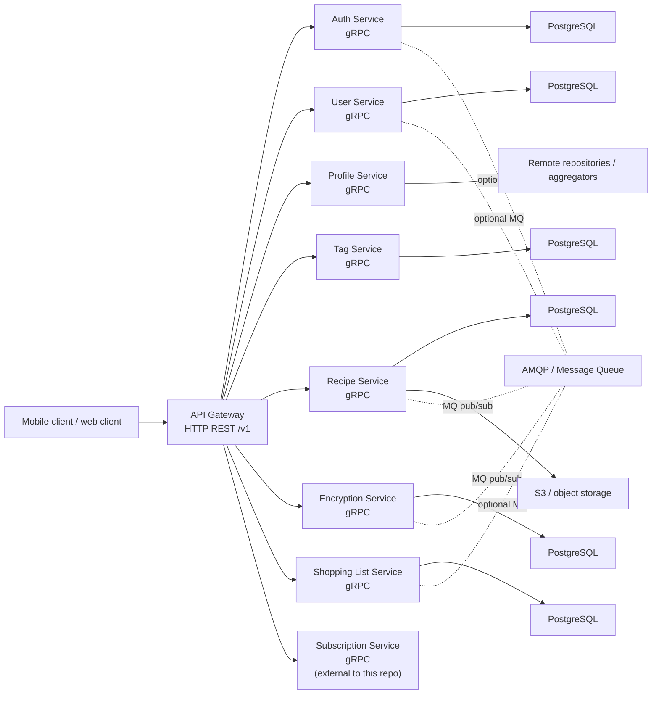
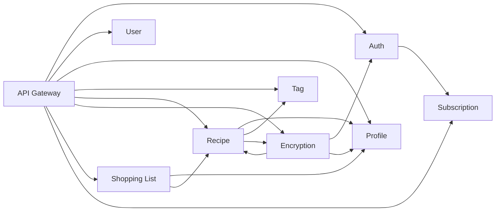
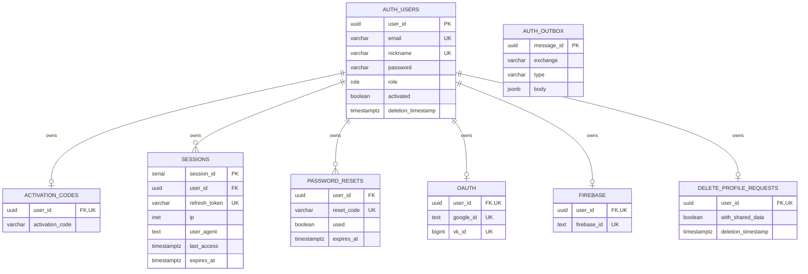
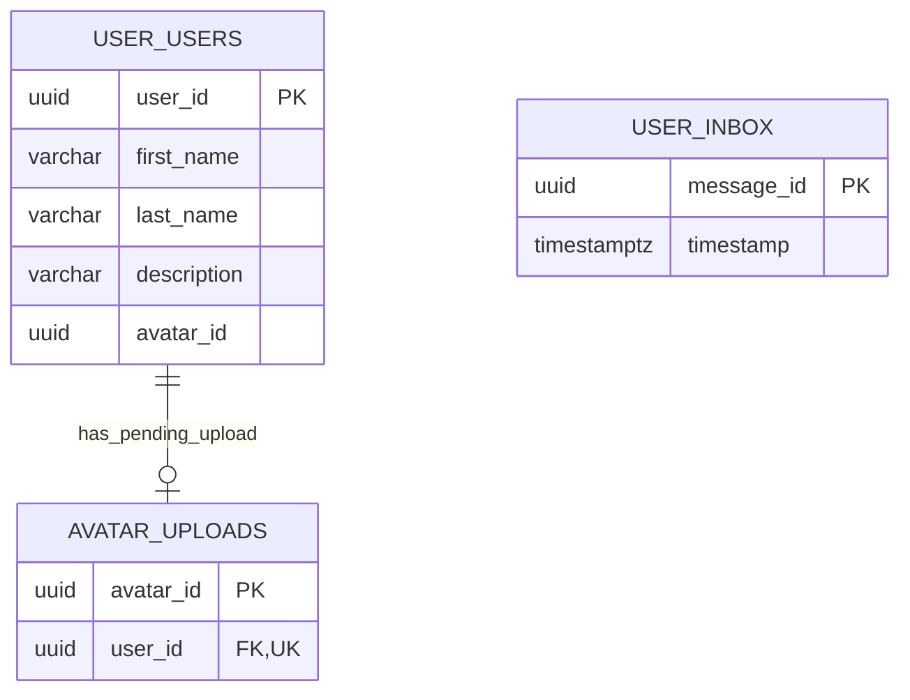
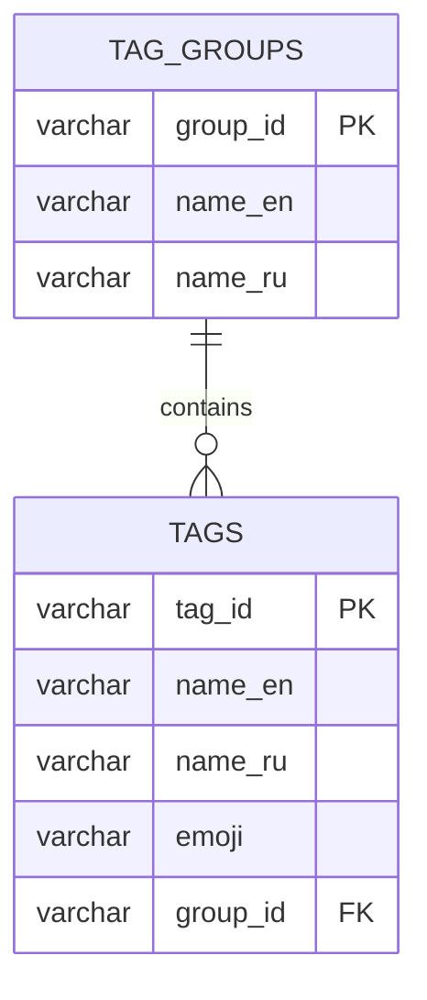
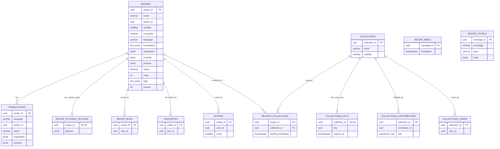
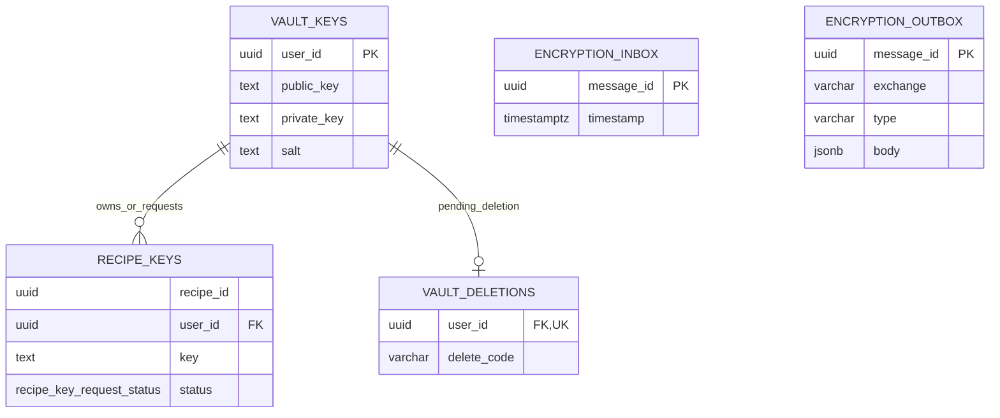
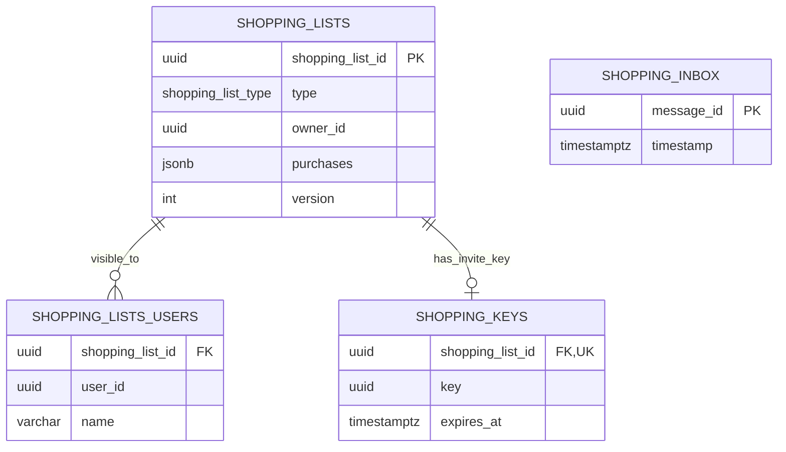

# ChefBook Backend API Architecture

This document is a working map of the backend API as it exists in the repository today.

## Purpose

- explain where the external API lives
- show which service owns which domain
- show how services call each other
- give a stable reference for future backend and client work

## Top-Level Shape

## Request Path

1. Client calls `api-gateway` over HTTP.
2. Gateway applies recovery, request logging, and rate limiting.
3. Protected endpoints pass through auth middleware.
4. Auth middleware fetches the JWT public key from `AuthService` and caches it for a refresh interval.
5. Gateway handlers translate HTTP requests into gRPC calls to domain services.
6. Domain services execute business logic using their own database and, where needed, S3, MQ, or other services.

## API Gateway

Gateway entrypoint:
- `chefbook-backend/api-gateway`

Gateway responsibilities:
- public HTTP API under `/v1`
- JWT validation and user authorization
- request logging and rate limiting
- HTTP-to-gRPC translation
- Swagger docs in non-release mode
- health endpoint at `/healthz`

Global middleware:
- `gin.Recovery()`
- request log middleware
- rate limiter
- auth middleware on protected routes

Docs and health:
- `/doc/*any`
- `/healthz`

## External HTTP API Groups

Base prefix:
- `/v1`

Route groups:
- `/auth` for sign-up, activation, sign-in, refresh, sign-out, OAuth, sessions, password flows, nickname flows
- `/subscriptions` for subscription reads and Google subscription confirmation
- `/profile` for current user profile data and avatar management
- `/profiles/:profileId` for reading another profile
- `/recipes` for recipe CRUD, book, favourites, pictures, rating, translations, and recipe-to-collection binding
- `/recipes/tags` for tags lookup inside recipe flows
- `/collections` for collection CRUD and save/remove from recipe book
- `/encryption/vault` for encrypted vault lifecycle
- `/encryption/recipes/:recipeId` for recipe key ownership and sharing
- `/shopping-lists` for personal/shared shopping list flows, users, and invite links

## gRPC Service Ownership

### `AuthService`

Owns:
- account lifecycle
- JWT issuing
- OAuth integration
- sessions
- password reset / change
- nickname availability and assignment
- profile deletion state

Main RPC families:
- `SignUp`, `ActivateProfile`, `SignIn`, `RefreshSession`, `SignOut`
- `RequestGoogleOAuth`, `SignInGoogle`, `ConnectGoogle`, `DeleteGoogleConnection`
- `RequestVkOAuth`, `SignInVk`, `ConnectVk`, `DeleteVkConnection`
- `GetSessions`, `EndSessions`
- `RequestPasswordReset`, `ResetPassword`, `ChangePassword`
- `GetProfileDeletionStatus`, `DeleteProfile`, `CancelProfileDeletion`
- `GetAccessTokenPublicKey`, `GetAuthInfo`, `GetVisibleNames`, `CheckNicknameAvailability`, `SetNickname`

### `UserService`

Owns:
- source-of-truth user social data
- name
- description
- avatar upload lifecycle

Main RPC families:
- `GetUsersMinInfo`, `GetUserInfo`
- `SetUserName`, `SetUserDescription`
- `GenerateUserAvatarUploadLink`, `ConfirmUserAvatarUploading`, `DeleteUserAvatar`

### `ProfileService`

Owns:
- aggregated profile read models

Main RPC families:
- `GetProfile`
- `GetProfilesMinInfo`

Important note:
- gateway profile handlers are composite and use `AuthService`, `UserService`, and `ProfileService` together

### `TagService`

Owns:
- tag taxonomy and lookup

Main RPC families:
- `GetTags`
- `GetTagsMap`
- `GetTag`
- `GetTagGroups`

### `RecipeService`

Owns:
- recipes
- recipe book state
- favourites
- collections
- recipe pictures upload coordination
- translations
- rating
- recipe policy reads

Main RPC families:
- `GetRecipes`, `GetRandomRecipe`, `GetRecipeBook`
- `CreateRecipe`, `GetRecipe`, `UpdateRecipe`, `DeleteRecipe`
- `GenerateRecipePicturesUploadLinks`, `SetRecipePictures`
- `RateRecipe`
- `SaveRecipeToRecipeBook`, `RemoveRecipeFromRecipeBook`
- `SaveRecipeToFavourites`, `RemoveRecipeFromFavourites`
- `AddRecipeToCollection`, `RemoveRecipeFromCollection`, `SetRecipeCollections`
- `TranslateRecipe`, `DeleteRecipeTranslation`
- `GetRecipePolicy`, `GetRecipeNames`
- `GetCollections`, `CreateCollection`, `GetCollection`, `UpdateCollection`, `DeleteCollection`
- `SaveCollectionToRecipeBook`, `RemoveCollectionFromRecipeBook`

### `EncryptionService`

Owns:
- encrypted vault metadata
- recipe key storage and sharing requests

Main RPC families:
- `HasEncryptedVault`, `GetEncryptedVaultKey`, `CreateEncryptedVault`
- `RequestEncryptedVaultDeletion`, `DeleteEncryptedVault`
- `GetRecipeKeyRequests`, `RequestRecipeKeyAccess`
- `GetRecipeKey`, `SetRecipeKey`, `DeleteRecipeKey`

### `ShoppingListService`

Owns:
- personal and shared shopping lists
- shopping list user membership
- shopping list invite link flow

Main RPC families:
- `GetShoppingLists`
- `CreateSharedShoppingList`, `GetShoppingList`
- `SetShoppingListName`, `SetShoppingList`, `AddPurchasesToShoppingList`
- `DeleteSharedShoppingList`
- `GetShoppingListUsers`, `GetSharedShoppingListLink`
- `JoinShoppingList`, `DeleteUserFromShoppingList`

### `SubscriptionService`

Status:
- referenced by gateway and some services
- implementation is not present in this repository snapshot

Known roles from code:
- subscription reads in gateway
- subscription-aware checks in recipe, encryption, shopping-list
- remote dependency of auth service

## Inter-Service Dependency Graph

## Storage and Integration Boundaries

Per-service storage:
- `auth` uses PostgreSQL
- `user` uses PostgreSQL
- `tag` uses PostgreSQL
- `recipe` uses PostgreSQL
- `encryption` uses PostgreSQL
- `shopping-list` uses PostgreSQL

Extra integrations:
- `recipe` uses S3 for recipe pictures
- `auth`, `user`, `recipe`, `encryption`, `shopping-list` include AMQP integration paths
- all main services expose gRPC and gRPC health checks

## Database Schema

Each service owns its own PostgreSQL schema. Foreign keys are local to a service database only; IDs that point to another service, such as `owner_id`, `user_id`, or `recipe_id`, are logical cross-service references and are not enforced by PostgreSQL.

### Auth Database

Owns credentials, sessions, OAuth bindings, Firebase bindings, activation codes, password reset codes, profile deletion requests, and outgoing events.

Important constraints:
- `users.email` and `users.nickname` are unique.
- `activation_codes`, `oauth`, `firebase`, and `delete_profile_requests` are one-to-one with `users`.
- `password_resets.reset_code` and `sessions.refresh_token` are globally unique.

### User Database

Owns public profile fields and avatar upload lifecycle. Auth identity is linked by the same `user_id`, but there is no database FK to the auth service.

### Tag Database

Owns localized tag groups and tags used by recipe search and recipe metadata.

### Recipe Database

Owns recipes, recipe read state, favourites, scores, translations, pictures, collections, collection membership, collection sharing keys, and MQ inbox/outbox.

Important constraints:
- `recipes.encrypted=true` cannot be combined with `visibility='public'`.
- `translations` are unique by `(recipe_id, language, author_id)`.
- `recipe_book`, `favourites`, `scores`, `collections_contributors`, `collections_users`, and `recipes_collections` are unique by their pair keys.
- `recipes.translations` and `recipes.tags` have GIN indexes.
- `owner_id`, `user_id`, `author_id`, and `contributor_id` reference users logically across services.

### Encryption Database

Owns encrypted vault keys, recipe access keys, key request status, vault deletion codes, and MQ inbox/outbox.

Important constraints:
- `recipe_keys` are unique by `(recipe_id, user_id)`.
- `recipe_keys.recipe_id` is a logical reference to the recipe service.
- `recipe_keys.user_id` is a local FK to `vault_keys`, not to auth/user.

### Shopping List Database

Owns personal/shared shopping lists, per-user list names, invite keys, and MQ inbox.

Important constraints:
- `shopping_lists_users` is unique by `(shopping_list_id, user_id)`.
- `shopping_lists_users.name` is the user's display name for that list, not the profile/user name.
- `shopping_lists.version` is used for optimistic updates.
- `owner_id` and `shopping_lists_users.user_id` are logical cross-service user references.

## Internal Service Template

Most services follow this shape:

- `cmd/` for runtime entrypoints and migrations
- `internal/app` for process bootstrap
- `internal/transport/grpc` for gRPC server adapters
- `internal/repository/postgres` for persistence
- `internal/repository/grpc` for remote service clients when needed
- `migrations/` for schema changes
- `deployments/helm` for Kubernetes deployment
- `api/proto/contract/v1` for service contract source
- `api/proto/implementation/v1` for generated gRPC code

## Practical Rules For Future Work

- If the task changes public HTTP shape, start in `api-gateway`.
- If the task changes domain behavior, start in the owning service.
- If the task changes a gRPC contract, update both the owning service and every caller.
- If the task touches profile endpoints, expect orchestration across `auth`, `user`, and `profile`.
- If the task touches encrypted recipes, expect `recipe` and `encryption` to be coupled.
- If the task touches shopping lists, check both direct list logic and recipe/profile dependencies.
- If the task touches subscriptions, verify whether the dependency lives outside this monorepo.

## Important Gaps And Caveats

- `SubscriptionService` is referenced but not implemented in this repository.
- `ProfileService` is an aggregator; some profile behavior is split between gateway orchestration and downstream services.
- MQ event topology is present in code, but queue names and event contracts were not mapped in this first pass.
- Swagger exists for the gateway, but this document is the clearer architecture map for human navigation.

## Recommended Next Artifacts

- a route-to-RPC matrix for every `/v1` endpoint
- an event/MQ topology document
- a data ownership table per service and table family
