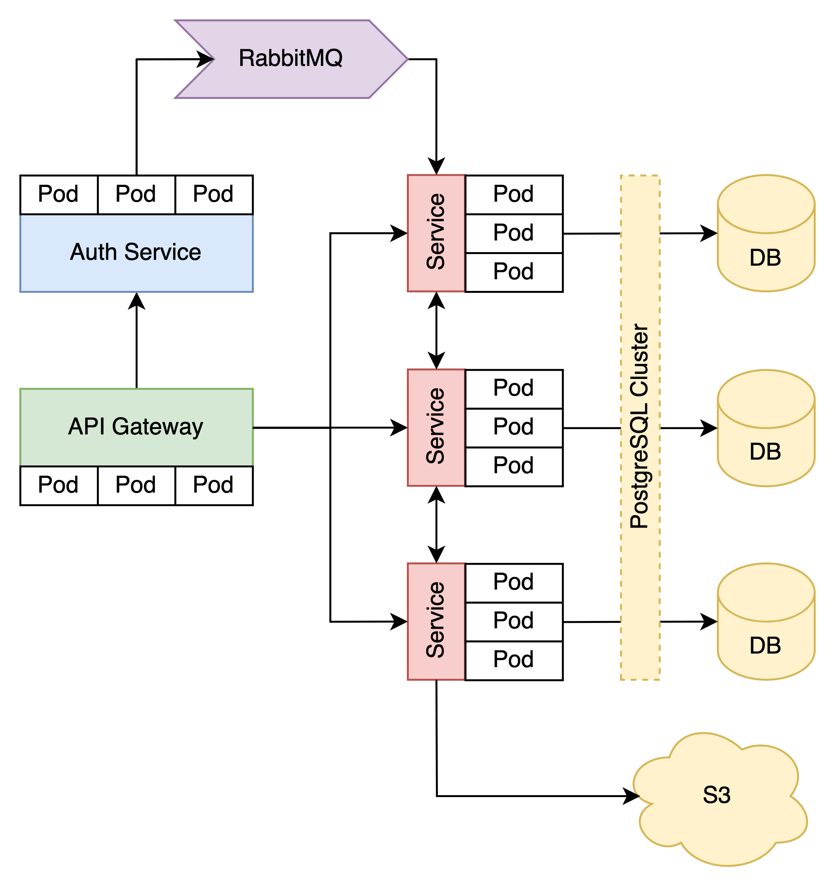

# ChefBook backend

ChefBook backend root repository

## Architecture

    

ChefBook uses pretty default microservice architecture. Each service has its own isolated database.
Services communicate each other via sync gRPC or async Message Queue, if it's need.
Server accessible by client via API Gateway, that forwards traffic to target service.
Auth takes place via JWT Token, signed with RSA keypair. API Gateway periodically fetches public key by Auth Service.

## Modules

* `common-lib` - Go common library for infrastructure applications
* `api-gateway` - API Gateway with REST-gRPC conversion
* `service/template` - template for new ChefBook service
* `services/auth` - service provides user authentication/authorization flow
* `services/user` - service provides base user social information such name, bio and avatar
* `services/profile` - service aggregates profile info from other services such as auth and user
* `services/shopping-list` - service provides shopping list feature
* `secrets` - Helm Chart with sensitive information, encrypted with [Sealed Secrets](https://github.com/bitnami-labs/sealed-secrets) (obviously, repository is private)