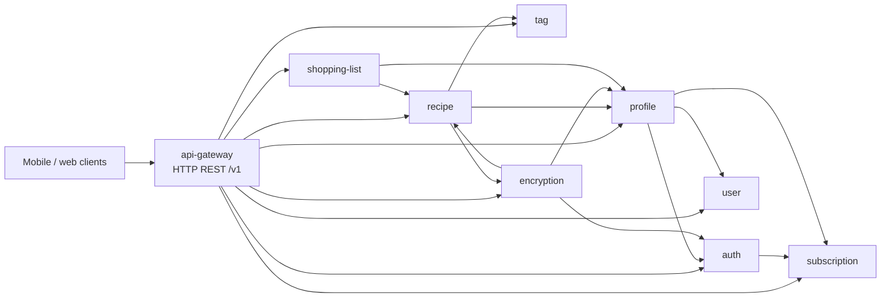
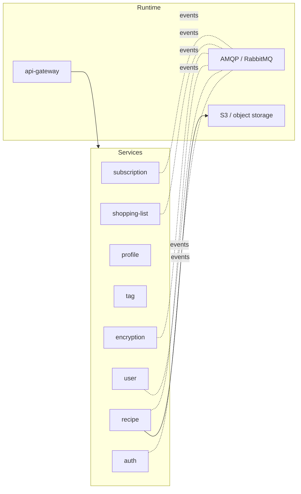

# ChefBook Backend

ChefBook backend is a Go microservice workspace. This repository is a composition of backend submodules: the API gateway, reusable infrastructure libraries, secrets, and domain services.

Use this README as the top-level architecture map. Service-specific ownership, contracts, storage, and runtime notes live in each service README.

## Repository Shape

- `api-gateway` - public HTTP entrypoint and REST-to-gRPC bridge
- `common` - reusable backend infrastructure packages
- `services/auth` - accounts, credentials, sessions, OAuth, JWT issuing
- `services/user` - public user profile fields and avatar upload lifecycle
- `services/profile` - aggregated profile read models
- `services/tag` - tag taxonomy and localized lookup
- `services/recipe` - recipes, recipe book, collections, favourites, ratings, translations
- `services/encryption` - encrypted vault metadata and recipe key access
- `services/shopping-list` - personal and shared shopping lists
- `services/subscription` - subscription state and payment-provider confirmation
- `services/broccoins` - Broccoins domain placeholder
- `services/template` - template for new backend services
- `secrets` - encrypted deployment secrets

## Service Map

```mermaid
flowchart LR
    Client["Mobile / web clients"] --> Gateway["api-gateway<br/>HTTP REST /v1"]

    Gateway --> Auth["auth"]
    Gateway --> User["user"]
    Gateway --> Profile["profile"]
    Gateway --> Tag["tag"]
    Gateway --> Recipe["recipe"]
    Gateway --> Encryption["encryption"]
    Gateway --> Shopping["shopping-list"]
    Gateway --> Subscription["subscription"]

    Auth --> Subscription

    Profile --> Auth
    Profile --> User
    Profile --> Subscription

    Recipe --> Profile
    Recipe --> Tag
    Recipe --> Encryption

    Encryption --> Auth
    Encryption --> Profile
    Encryption --> Recipe

    Shopping --> Profile
    Shopping --> Recipe
```

## Integration Shape

```mermaid
flowchart LR
    subgraph Runtime
        Gateway["api-gateway"]
        MQ["AMQP / RabbitMQ"]
        S3["S3 / object storage"]
    end

    subgraph Services
        Auth["auth"]
        User["user"]
        Profile["profile"]
        Tag["tag"]
        Recipe["recipe"]
        Encryption["encryption"]
        Shopping["shopping-list"]
        Subscription["subscription"]
    end

    Gateway --> Services
    Auth -. events .- MQ
    User -. events .- MQ
    Recipe -. events .- MQ
    Encryption -. events .- MQ
    Shopping -. events .- MQ
    Subscription -. events .- MQ
    Recipe --> S3
```

## Ownership Rule

Each service owns its domain behavior, storage, migrations, API module, and deployment chart. Cross-service references are logical IDs passed through gRPC or MQ contracts; databases should not enforce foreign keys to another service database.

For implementation work:

- Start in `api-gateway` when changing public HTTP routes, auth middleware, request DTOs, response DTOs, or REST-to-gRPC mapping.
- Start in the owning service when changing domain behavior, persistence, migrations, MQ handlers, or service gRPC contracts.
- Update both sides when a gRPC or MQ contract changes.
- Use the smallest affected module for validation before broader checks.

## Service Details

- [API Gateway](api-gateway/README.md)
- [Auth Service](services/auth/README.md)
- [User Service](services/user/README.md)
- [Profile Service](services/profile/README.md)
- [Tag Service](services/tag/README.md)
- [Recipe Service](services/recipe/README.md)
- [Encryption Service](services/encryption/README.md)
- [Shopping List Service](services/shopping-list/README.md)
- [Subscription Service](services/subscription/README.md)
- [Broccoins Service](services/broccoins/README.md)
- [Service Template](services/template/README.md)
- [Common Library](common/README.md)
- [Secrets](secrets/README.md)

## Agent Navigation

For agent work, use this README as the service dependency map, then open the nearest service README and `AGENTS.md` before editing files. Keep concrete service architecture in service-local README files so submodule context remains useful on its own.
